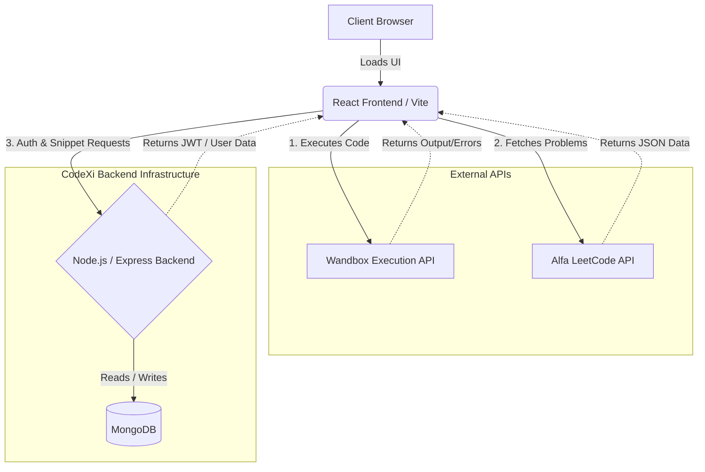

# CodeXi - Interactive Coding Platform

CodeXi is a full-stack, browser-based coding platform heavily inspired by platforms like LeetCode. It provides a seamless interactive environment for developers to solve algorithmic problems, write test code, and securely save custom snippets to the cloud without needing to install local compilers.

## 🚀 Features
- **Integrated IDE:** Powerful in-browser coding experience powered by Monaco Editor (VS Code engine).
- **Multi-Language Support:** Compile and execute JavaScript, Python, C++, and Java instantly.
- **Problem Solving:** Browse a library of algorithmic problems fetched directly from an external API.
- **Cloud Snippets:** Save, edit, and organize your code snippets securely.
- **Secure Authentication:** Full user authentication system including Email/Password and Google OAuth.

---

## 💻 Technology Stack

### **Frontend**
- **React.js (Vite):** Chosen for its blazing-fast module replacement and efficient virtual DOM rendering, ideal for complex UIs like an IDE.
- **Monaco Editor:** Provides robust syntax highlighting, indentation, and an authentic developer experience identical to VS Code.
- **Tailwind CSS & Radix UI (Shadcn):** For rapidly building highly customized, accessible, and responsive components.
- **Axios:** For clean, promise-based HTTP requests to our backend and third-party APIs.

### **Backend**
- **Node.js & Express:** Event-driven architecture handles high-volume asynchronous network requests incredibly efficiently.
- **MongoDB & Mongoose:** A flexible NoSQL database perfectly suited for storing unstructured code snippets and dynamic user profiles.
- **JWT (JSON Web Tokens):** Enables secure, stateless authentication and authorization across the application.
- **Bcrypt:** Ensures user passwords are salted and securely hashed before ever touching the database.

### **Third-Party APIs & Microservices**
- **Wandbox Execution API:** An external compilation engine that safely compiles and runs untrusted user code in isolated sandboxes.
- **Alfa LeetCode API:** Fetches algorithmic problem descriptions and metadata.

---

## 🏗️ Architecture & Working Flow

CodeXi follows a decoupled **Client-Server architecture**, leveraging external microservices to offload heavy computations and increase security.

### **High-Level Flow Diagram**

### **Working Flow Deep Dive**
1. **Client Rendering:** The user accesses the application. The React app is served and renders the user interface, including the Monaco code editor.
2. **Fetching Problems:** If the user navigates to a specific problem page, the frontend directly calls the `Alfa LeetCode API` to retrieve the problem description, difficulty, and ID.
3. **Writing Code:** As the user types, the Monaco Editor provides live syntax highlighting based on the selected language (JS, Python, C++, Java).
4. **Code Execution:** When the user clicks "Run", the raw code string and standard input (stdin) are packaged into a JSON payload. Instead of processing this locally, the frontend securely dispatches it to the **Wandbox Execution API**. Wandbox creates an isolated sandbox, compiles the code, executes it, and streams the standard output (`stdout`) or standard error (`stderr`) back to the browser.
5. **Saving Snippets:** When saving work, the frontend sends the code and a secure **JWT** to the Node.js backend. The Express router verifies the token signature. If authorized, the backend inserts the snippet into the connected **MongoDB** database, linked via a reference to the User's ID.
6. **Authentication:** User signups are processed by the backend, where plaintext passwords are encrypted via `Bcrypt` before storage. Logins generate a signed JWT returned to the client's local storage for seamless persistent sessions.
